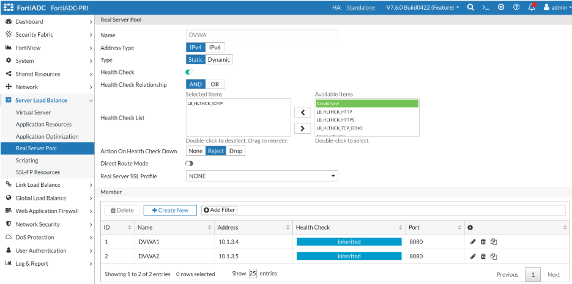

##   Real Servers

Real servers are physical/virtual servers or public cloud instances that form real server pools. The Real Server configuration object specifies the status, type, and IP address or FQDN of the physical server. This Real Server configuration object can then be used as a member to form a real server pool.
When FortiADC is deployed in L7 mode (reverse proxy), a new TCP session is established from the FortiADC to the real server. A "Real Server SSL Profile" determines how SSL is negotiated between the FortiADC and the real server.

In the Next Few Steps we will Define Real Servers and use them to create a Server Pool.

For this lab we will define two application servers. 
#### Configure Real Servers
On the Web manangement interface of the FortiAdc, Go to

**Server Load Balance → Real Server Pool**  
**Click on Real Server Tab**  
**Create New**  

 

**Name** :APP-Server1  
**Server Type**: Static  
**Status**: Enable 
**Type**:IP 
**Address**: 10.1.3.4 
**Save** 

 We will repeat the same steps as above to add the second application server. 

**Name** :APP-Server2  
**Server** Type: Static  
**Status**: Enable  
**Type**:IP  
**Address**: 10.1.3.5  
**Save** 

 

Your final result should look like the image below  

In the above example, we used IP addresses to define the real servers. However, we also have additional mechanisms, such as FQDN, to define the real servers. Additionally, the server status can be set to "disabled" to ensure FortiADC will not send traffic to the server, or it can be put in "maintenance mode" to allow current sessions to continue while preventing new sessions from being sent to the server. Please refer to the user guide for additional details

##   Server Pool
 
A server pool consists of multiple servers working together to manage incoming requests efficiently. By distributing the workload across all servers, the pool prevents any single server from becoming overloaded. A load balancer directs traffic to servers within the pool based on predefined criteria such as server capacity, current load, and health status. This configuration improves the availability, scalability, and reliability of applications and services.

Once a server is added to the pool, a health check must be assigned to ensure the FADC can assess the server’s status and availability before forwarding requests.

In the next step, we will define a new pool, add the servers created in the previous exercise, and bind the health check from the first exercise to ensure proper monitoring and load distribution 

On the Web manangement interface of the FortiAdc, Go to  
**Server Load Balance → Real Server Pool**  
Click on **Real Server Pool Tab**  
**Create New**  

**Name**: Web-Application  
**HealthCheck**: enable the toggle for health check and add the health check we created earlier 
Click **ok**  to save the configuration  

*Please note that if there is a requirement to encrypt the traffic between FortiADC and the application servers, you must configure the Real Server SSL profile and enable it within the server pool definition.*

Click on the **Create new** button under Member 

**Real Server:**  APP-Server1 from the drop down menu  
Accept default values for the other options  
**Save** 

Repeat the above process to add the second application server to the pool .  

**Real Server:**  APP-Server2 from the drop down menu   
Accept default values for the other options   
**Save**

 

Since we will be using two applications to run our lab we will repeat the above steps again to define our second Real server Pool. 

***Create Real Servers for 2nd application***

In this section we will define two application servers.  
On the Web manangement interface of the FortiAdc, Go to  

**Server Load Balance → Real Server Pool**  
Click on **Real Server Tab**  
**Create New**

**Name :** DVWA1  
**Server Type:** Static  
**Status:** Enable  
**Type:** IP  
**Address:** 10.1.3.4  
**Save**  

**Name :** DVWA2  
**Server Type:** Static  
**Status:** Enable  
**Type:** IP  
**Address:** 10.1.3.5  
**Save**  

 

Next we will create a Server Pool and add the servers we created to the new pool.  
On the Web manangement interface of the FortiAdc, Go to  

**Name:** DVWA  
**HealthCheck**: enable the toggle for health check and add the builtin LB\_HLTCHK\_ICMP   
Click **ok**  to save the configuration  

Add the Real Servers defined in the previous step to the pool   
Your final result should look like the image below 

