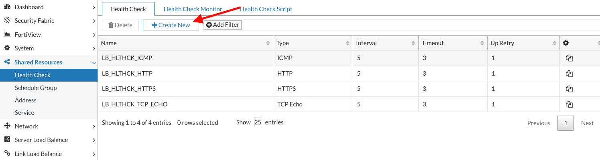
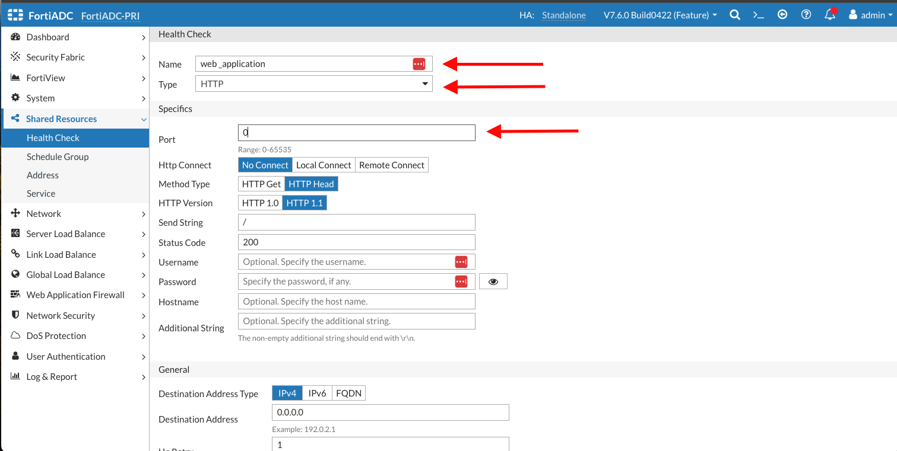

### Health Checks

In server load balancing deployments, the system uses health checks to poll the members of the real server pool to determine if an application is available. You can also configure additional health checks to poll related servers, and include results for both in the health check rule. For example, you can configure an HTTP health check test and a database server health check test. In a web application that requires access to a database to function, the web server is deemed available only if both the web server and the related database server pass the health check.

##### Configure Health Check 

On the Web manangement interface of the FortiAdc Go to  

**Shared resources → Health check**  
Click on **Create New**

**Name**  Web Application  
**Type** 	HTTP  
**Port**	0 
**Save** 

*Notice that when you change the Type to HTTP, additional options related to HTTP become available, such as method, version, response code, and authentication requirements. For this exercise, we will accept the default values for all other entries except those defined above.*

