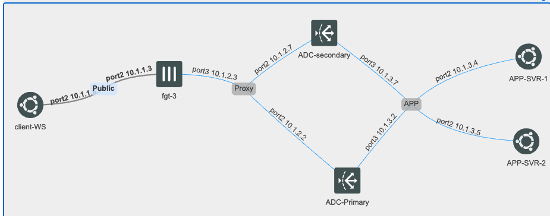

### Initial configuration  (15 min)

## Prereqs
  For this lab, we have set up an environment featuring two identical application servers positioned behind a pair of FortiADCs configured in High Availability (HA) mode. Additionally, we have included a FortiGate and a client workstation to simulate a typical client environment and facilitate testing
  

  ## HTTP load balancing

In this section, we will review the steps needed to configure web application load balancing. The goal of deploying load balancers is to increase the availability of application servers, scale them to meet demand, and, in some cases, modify content before sending the request to the origin server.

{} Notice The steps outlined in this section have already been set up. We recommend reviewing them to become familiar with the configuration process.

{}
