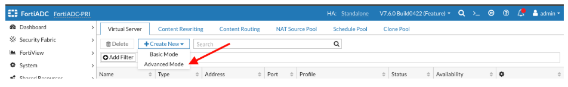
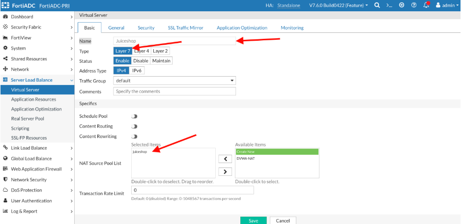
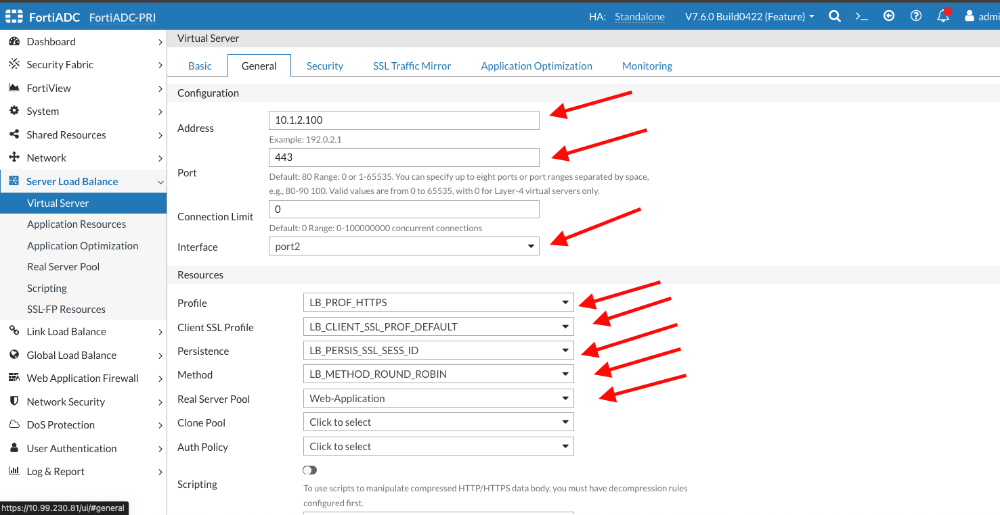
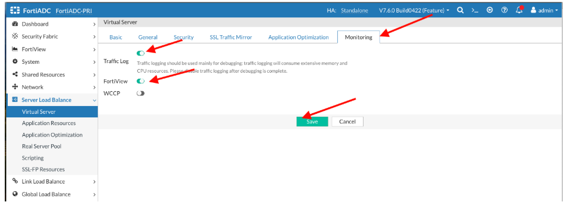
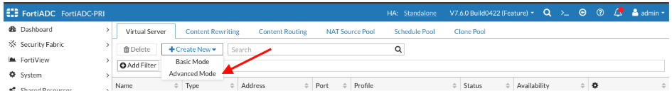
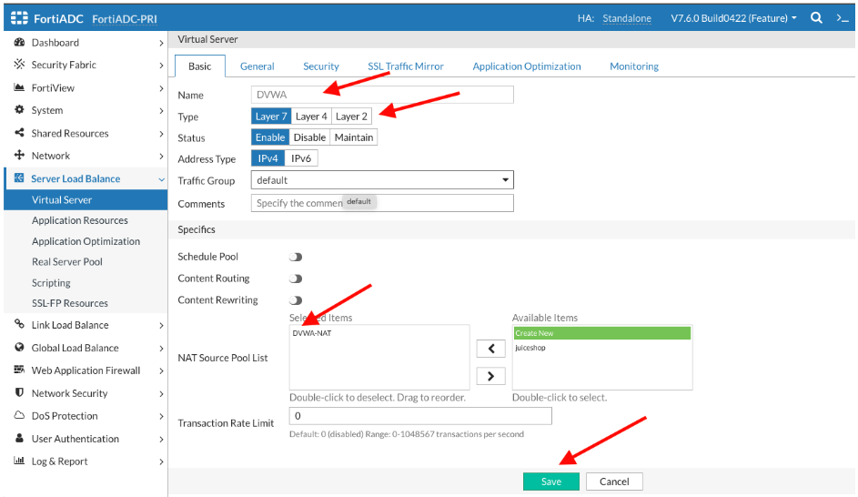
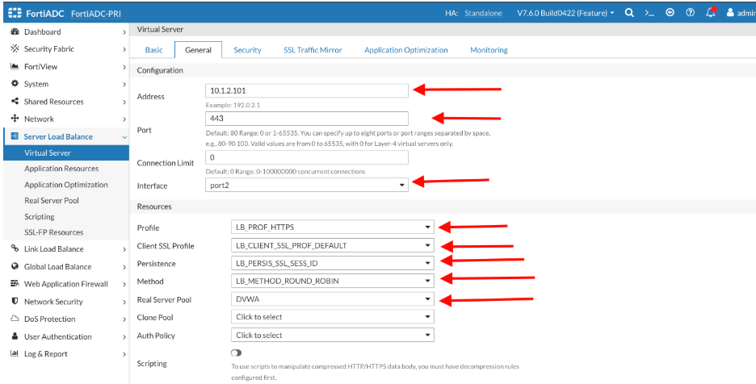
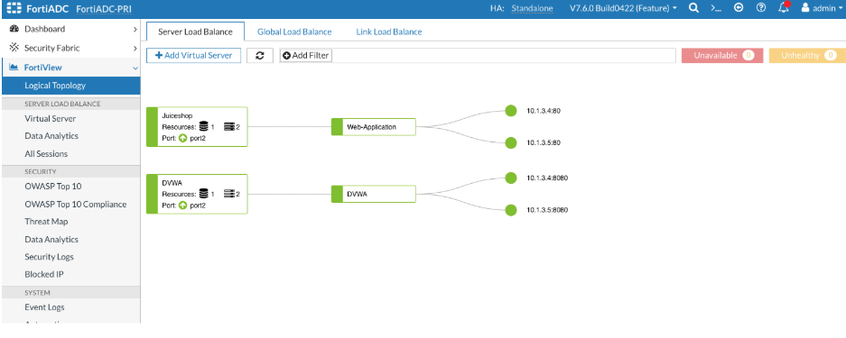
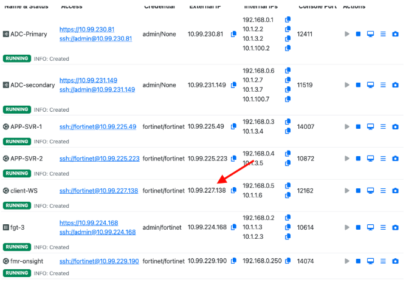
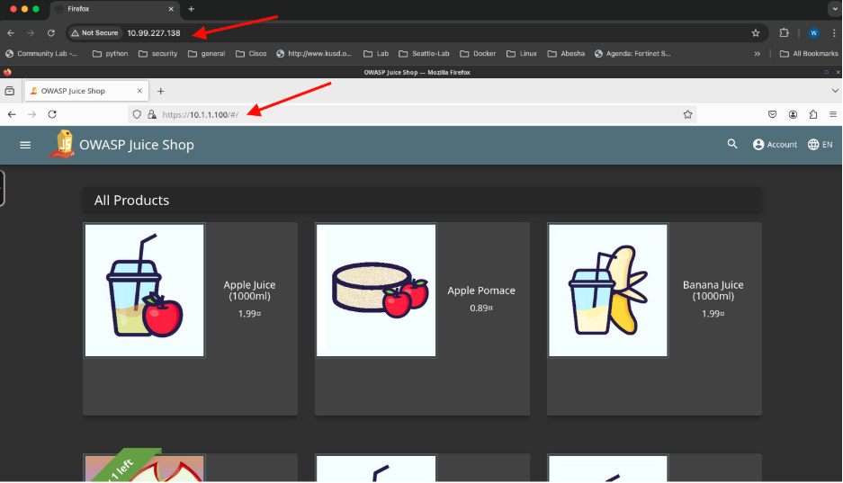

## Task 3: Define virtual server 

The next step is to configure a virtual server, which defines the type of traffic FortiADC will manage and how it will be processed. For this exercise, we will create two virtual servers, one for each of our web applications, while using the default settings wherever possible. 

On the Web manangement interface of the FortiAdc, Go to  
**Server Load Balance →Virtual Server**
**Create New → Advanced Mode**

On the Basic TAB   
Name: **juiceshop**  
Type: **Layer7**  
Nat Source pool List: **Juiceshop**  
Click **Save**

Go to the **Genera**l TAB   
Address:**10.1.2.100**  
Port: **443**  
Interface: **Port2 ( from the dropdown Menu)**   
Profile:**LB\_PROF\_HTTPS**  
Client SSL Profile: **LB\_CLIENT\_SSL\_PROF\_DEFAULT**  
Persistence: **LB\_Persis\_SSL\_SESS\_ID**  
Method:**LB\_METHOD\_ROUNDROBIN**  
Real Server Pool:**WEB-APPLICATION**  
Click **Save** 

Go to the **MONITORING** TAB  
TRAFFIC LOG: **Enable the Toggle**  
FortiView: **Enable the Toggle**  
Click **Save**  

We will repeat the steps outlined above to create a virtual server for our second application.  
Server Load Balance →Virtual Server  
Create New → Advanced Mode

On the Basic TAB   
Name: **DVWA**  
Type: **Layer7**  
Nat Source pool List: **DVWA-NAT**  
Click **Save**

Go to the **Genera**l TAB   
Address:**10.1.2.101**  
Port: **443**  
Interface: **Port2 ( from the dropdown Menu)**   
Profile:**LB\_PROF\_HTTPS**  
Client SSL Profile: **LB\_CLIENT\_SSL\_PROF\_DEFAULT**  
Persistence: **LB\_Persis\_SSL\_SESS\_ID**  
Method:**LB\_METHOD\_ROUNDROBIN**  
Real Server Pool:**DVWA**  
Click **Save**

Go to the **MONITORING** TAB  
TRAFFIC LOG: **Enable the Toggle**  
FortiView: **Enable the Toggle**  
Click **Save**

Go to Fortiview→ logical Topology   
Your topology should look like the image below 

### Test Your Configuration

We have set up a VNC session that provides access to a Firefox browser on the client machine. To access the browser, open a browser on your local machine and enter the client machine’s IP address. In the example below, the management IP address of the client machine is 10.99.227.138, which you will input into your browser.

This will end the initial configuration section. 

