#### Testing and viewing the Adaptive learning 

For the next section we will use scripts that we will run on the client machine to generate traffic and to simulate attacks . 

SSH into the client machine   
fortinet/fortinet  
Change the directory dvwa : **cd dvwa**   
Run the script dvwa : **./dvwa**  

 

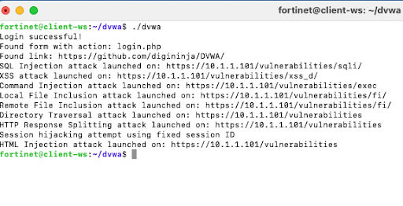

Login to the FADC   
Web application Firewall → Adaptive learning – \>Adaptive learning view   
Expand the DVWA TAB and observe the different directories detected by the module 

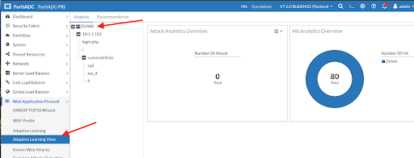
Click on the Login.php page and notice that the system has identified 3 parameters on the page and with the expected input type

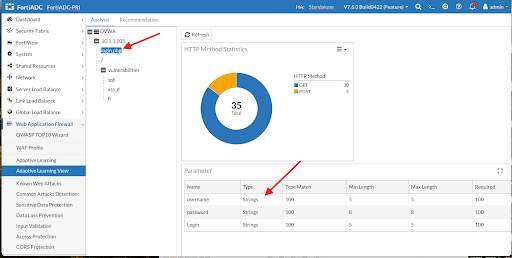

Expand the “fi” page and notice the system has identified a parameter called page 

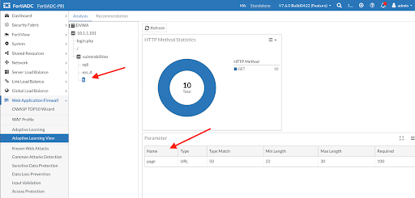

Switch over to the Recommendation TAB and review the details of the recommendations   
Accept the recommendations and review the config changes by the system 

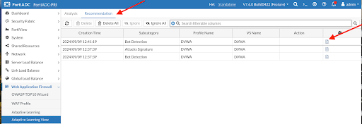

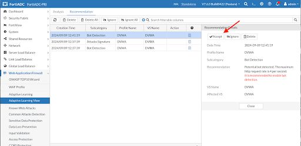

In the example below notice the web attack signature created and applied to our virt

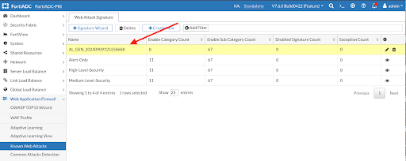
For the next section we will use a second script  that we will run on the client machine to generate traffic and to simulate attacks . 

SSH into the client machine   
fortinet/fortinet  
Change the directory jshop : **cd jshop**  
Run the script jshop : **./jshop**

**Enter the Juice Shop server address : [https://10.1.1.100](https://10.1.1.100)**

**Choose option 12 to generate traffic** 

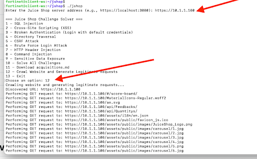

**Choose option 10 to simulate some attacks** 

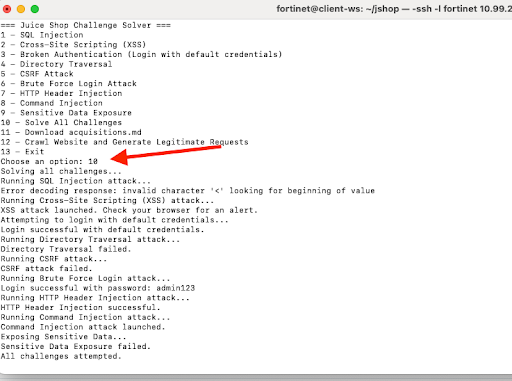

Login to the FADC   
Web application Firewall → Adaptive learning – \>Adaptive learning view   
Expand the Juiceshop TAB and observe the different directories detected by the module 

Click on the change-password page and notice that the system has identified 2 parameters on the page and with the expected input type  

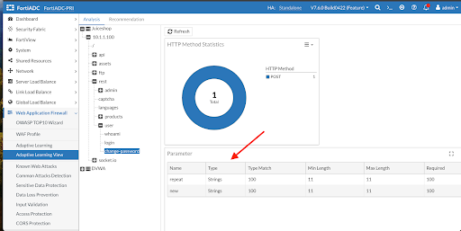

Switch over to the Recommendation TAB and review the details of the recommendations   
Accept the recommendations and review the config changes by the system

    

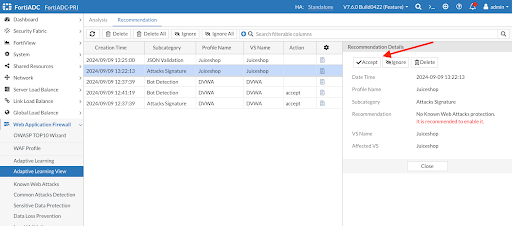

In the example below notice the web attack signature created and applied to our virt  

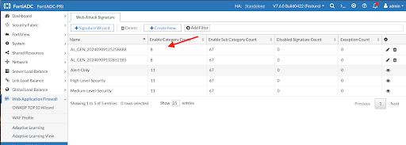

If you run the scripts from previous steps again , you will notice that the waf signature is catching the attacks  

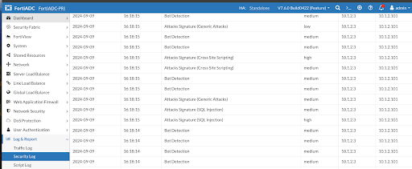  

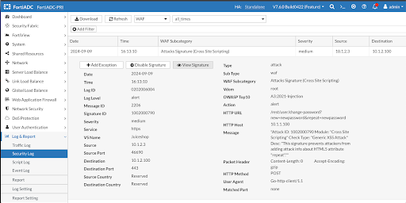

