######  *Configure Adaptive learning*  

Go to   
Web Application FireWall  → Adaptive learning    
Click on **Create New** 

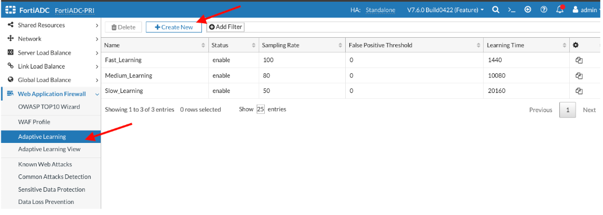
**Name**:JuiceShop  
**Status:** enable the toggle  
**Sampling Rate:** 100  
**False Positive Threshold**:100000   
**Learning Time** 1  
 **SAVE**  

 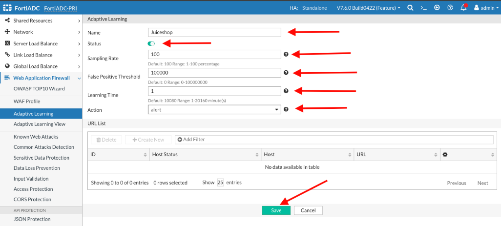

On the same page click on the **Create New** button to create a **URL LIST** 

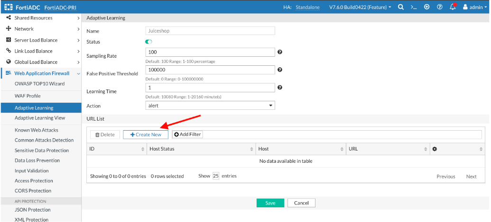

**URL** /\*  
**SAVE**

Click SAVE again .   

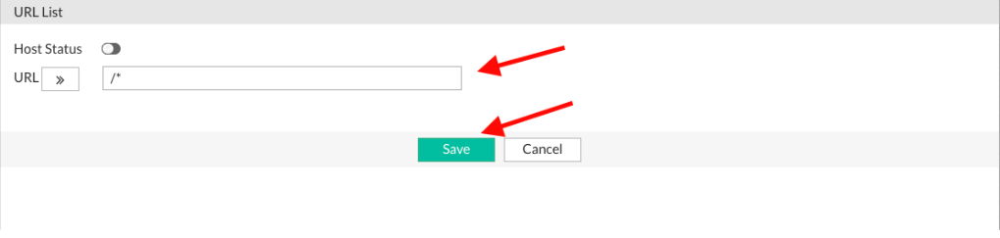
Click SAVE again . 

We will repeat the same steps for the second application 

**Name**:DVWA  
**Status:** enable the toggle  
**Sampling Rate:** 100  
**False Positive Threshold**:100000   
**Learning Time** 1  
 **SAVE**

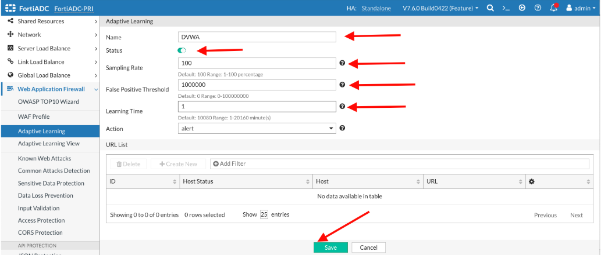
On the same page click on the **Create New** button to create a **URL LIST** 

**URL** /\*  
**SAVE**

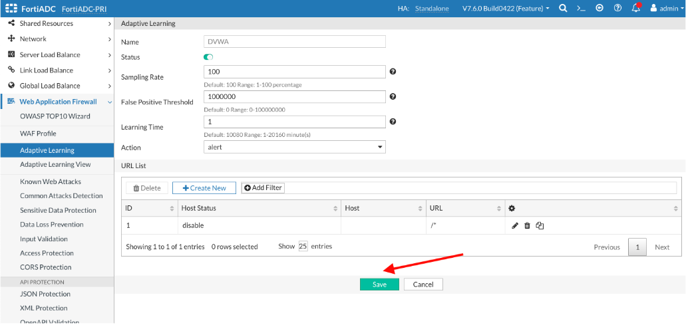

Click SAVE again .

The Adaptive Learning page should look like the image below 

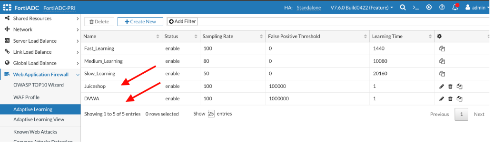
We will create a WAF profile and associate the Adaptive learning profiles we created with the WAF profile. 

######  *Configure WAF Profile*   

Go to   
Web Application FireWall  → WAF Profile   
Click on **Create New**  

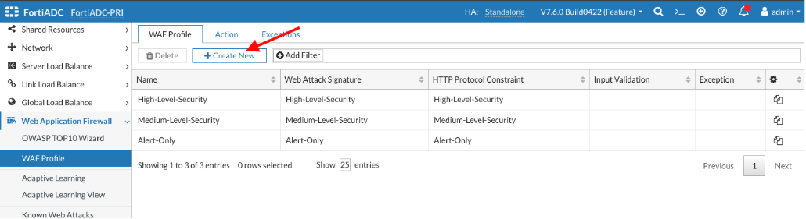
**Name**: Juiceshop  
**Adaptive Learning:** Juiceshop from the dropdown menu   
**SAVE**

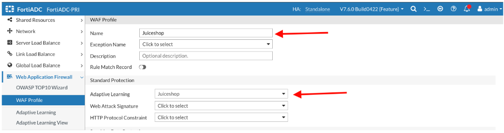
For this exercise, we will focus solely on configuring the adaptive learning module and will not configure the other WAF modules. In a production environment, however, all relevant WAF modules would be configured as needed to ensure comprehensive protection.

We will create a second WAF profile for the DVWA application   
Go to   
Web Application FireWall  → WAF Profile   
Click on **Create New**  

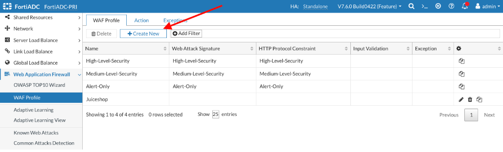

**Name**: DVWA  
**Adaptive Learning:** DVWA from the dropdown menu   
**SAVE**

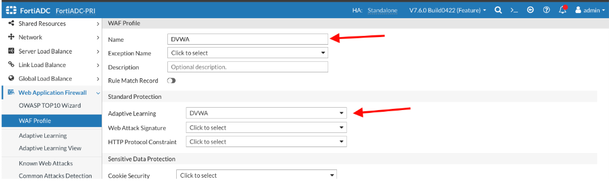
The WAF Profile page should look like the image below 

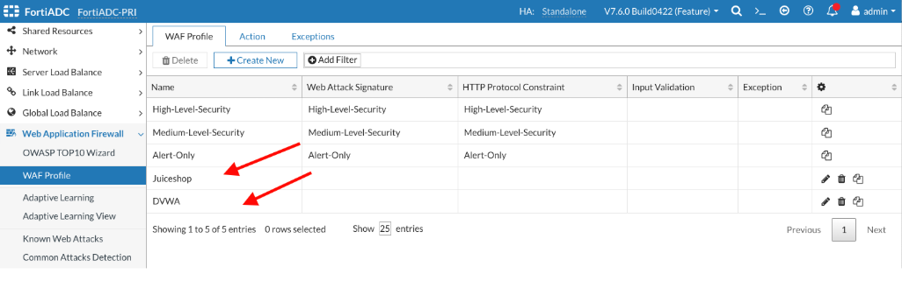
The next step is to associate the WAF profiles with a virtual server. Refer to the diagram in the traffic flow section to understand how traffic is processed through FortiADC for better context.

######  *Edit the virtual servers*  

Go to   
ServerLoad Balance  → Virtual Server  
Click on **juiceshop** 

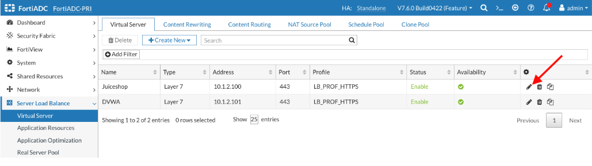
Click on the **Security** tab   
**WAF Profile:** Juiceshop from the dropdown menu  
**SAVE**

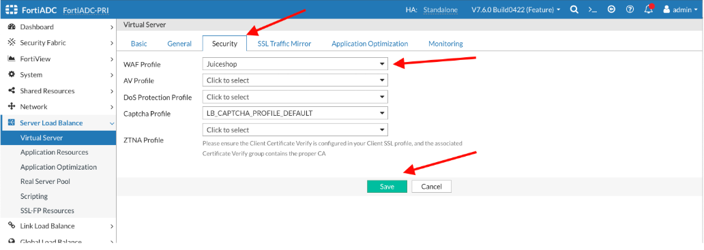
We will follow the same steps for configuring the second application. 

Go to   
ServerLoad Balance  → Virtual Server  
Click on **DVWA**

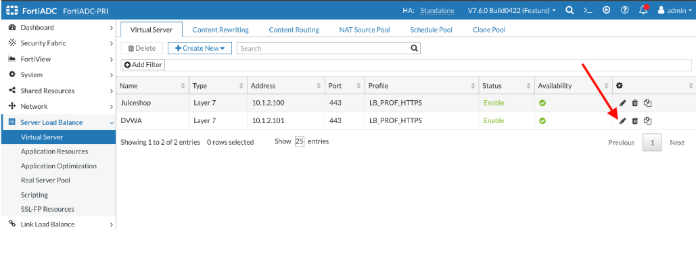
Click on the **Security** tab   
**WAF Profile:** DVWA from the dropdown menu  
**SAVE**

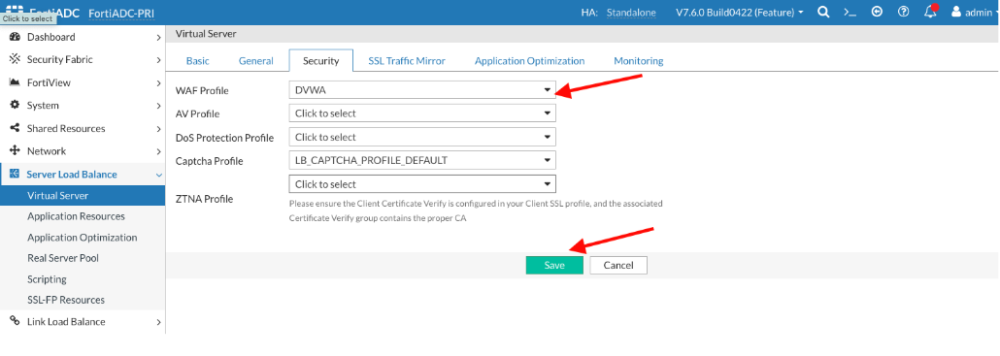
## 
