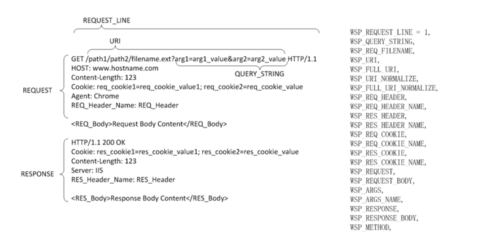

### ***Review FortiAdc web application Security features and configure adaptive learning duration 40min***
FortiADC provides a comprehensive security module, divided into four main categories:

1\. **Network Security**: This includes Intrusion Prevention System (IPS), Antivirus (AV), and IP address-based rules.  
2\. **Application Security**: Focuses on Web Application Firewall (WAF), including API protection and API gateway capabilities.  
3\. **Bot Mitigation**: Detects and mitigates traffic originating from automated sources.  
4\. **Denial of Service (DoS) Mitigation**: Provides protection against DoS attacks.

In this exercise, we will focus on Application Security. The other sections will be covered in future discussions.

### Application Security 

#### WAF Basic 

 A Web Application Firewall (WAF) is a security solution designed to protect web applications by filtering, monitoring, and blocking malicious traffic based on predefined rules. Positioned between a client and a web application, a WAF primarily aims to prevent attacks on web servers by inspecting HTTP/HTTPS traffic and defending against threats like SQL injection, cross-site scripting (XSS), and cross-site request forgery (CSRF). Unlike traditional firewalls, which focus on network-level security, a WAF operates at the application layer (Layer 7\) to analyze the behavior and content of web requests.

Deployed separately from the web application, a WAF offloads the resource-intensive process of security scanning from the web server, allowing centralized policy management across multiple servers. A WAF complements other perimeter security solutions, such as the FortiGate next-generation firewall. For example, the FortiADC WAF module applies security policies to different HTTP scanpoints, which represent various parsed elements of an HTTP transaction. Administrators can enable rules in the WAF policy settings to detect attacks at several points, including the request line, query string, filename, URI, request headers, request body, response code, and response body.

##### Components of FADC WAF 

* **Web Attack Signature policy** —The signature database includes signatures that can detect known attacks and exploits that can be found in 29 scanpoints. In your policy configuration, you choose classes of scanpoints to process: HTTP Headers, HTTP Request Body, and HTTP Response Body.  
* **URL Protection policy** — This policy enables you to create rules that detect patterns in the URI or the file extension.  
* **HTTP Protocol Constraint policy** — This policy enables you to create rules that restrict URI, header, and body length; HTTP method, or HTTP response code.  
* **SQL/XSS Injection Detection polic**y —This policy includes rules to detect SQL/XSS injection in the HTTP Request URI, HTTP Referer Header, HTTP Cookie Header, or HTTP Request Body.  
* **Cookie Security policy** — This policy enables you to create rules that prevent cookie-based attacks and apply them in a protection profile.  
* **Data Leak Prevention policy** — This policy enables you to create rules that prevent information leaks, damages and loss.  
* **HTTP Header Security policy** — This policy enables you to create rules to prevent or mitigate known XSS, clickjacking, and MIME sniffing security vulnerabilities. These response headers define security policies to client browsers so that the browsers avoid exposure to known vulnerabilities when handling requests.  
* **Input Validation Policy** — This policy enables you to create rules to prevent suspicious HTTP requests by verifying the user input from scan points like URL parameter, HTML form, hidden fields, and upload file.  
* **Brute Force Attack Detection policy** — This policy enables you to create rules to prevent too many login tests.  
* **Credential Stuffing Defense policy** — This policy enables you to create rules to identify login attempts using username and password that have been compromised using an always up-to-date feed of stolen credentials.  
* **JSON Detection policy** — This policy enables you to create rules that enforce security checks that examine client HTTP requests for anomalies in JSON data in HTTP POST operations.  
* **XML Detection policy** — This policy enables you to create rules that examine client requests for anomalies in XML code.  
* **OpenAPI Detection policy** — This policy enables you to create rules through defining a standard, language-agnostic interface to RESTful APIs, which allows both humans and computers to discover and understand the capabilities of the service without access to source code, documentation, or through network traffic inspection.  
* **API Gateway policy** — This policy includes an API management tool that sits between a client and a collection of backend services. It acts as a reverse proxy to accept all API calls and return the appropriate result.  
* **Bot Detection** — This policy includes rules to detect Bots. A Bot is an application that runs automated tasks over the Internet. The WAF supports two methods for detecting bad Bots: signature detection and behavior detection. You can also use allowlists to exclude known trusted sources (good Bots) from detection.  
* **Threshold Based Detection** — This policy enables you to create rules to detect bad bots, such as web crawlers, content scraping, and attack bots.  
* **Biometrics Based Detection** — This policy enables you to create rules that detect bots using behavioral biometrics such as mouse movement, keyboard, screen touch, and scroll.  
* **Advanced Protection policy** — This policy enables you to create rules that detect web crawlers and content scraping.  
* **CSRF Protection polic**y — This policy enables you to create rules that protect backend servers from CSRF attacks.

#### 

#### Adaptive learning 

​​The new FortiADC WAF Adaptive Learning feature enhances security by dynamically generating tailored recommendations to refine protection policies, allowing for quick and effective WAF configuration to counter evolving threats. By continuously performing deep packet inspection and traffic analysis, the Adaptive Learning engine builds comprehensive datasets from traffic patterns, enabling it to autonomously detect and mitigate threats with precision. These insights allow the engine to provide actionable recommendations for optimizing WAF policies, ensuring that security measures are adapted to the specific traffic characteristics of each web application. This results in an improved security posture and better operational performance through real-time adjustments and fine-tuning of security settings.

The WAF Adaptive Learning feature requires either a WAF Signature license or an Application Security bundle license. For users without a valid license, FortiADC offers a 30-day trial that activates automatically when upgrading to FortiADC version 7.6.0, allowing exploration of the WAF Adaptive Learning capabilities.

Here are some practical applications of the WAF Adaptive Learning functionality:

**Creating new WAF policies:** During the setup of a new virtual server, users can utilize the Adaptive Learning recommendation feature to automatically generate and apply basic WAF policies for a new WAF profile.  
**Enhancing existing WAF policies**: Users can adjust policy settings based on Adaptive Learning recommendations, which identify changes in traffic patterns to enhance the security of current WAF policies.  
**Identifying and reducing false positives**: The Adaptive Learning engine helps detect false positive triggers in WAF policies, allowing users to adjust settings and exclude unnecessary violations.

The Adaptive Learning engine has two key components: the Adaptive Learning policy, which defines the dataset, and the Adaptive Learning statistics, which contain the analytical results and actionable recommendations.

##### Configuration steps 

The configuration steps will be as follows 

1. Create Adaptive learning profile   
2. Create WAF profile and add the Adaptive learning profile created in step 1  
3. Associate the WAF profile with the virtual server created in Section one of the lab . 

Click the right arrow to go through each step individually
