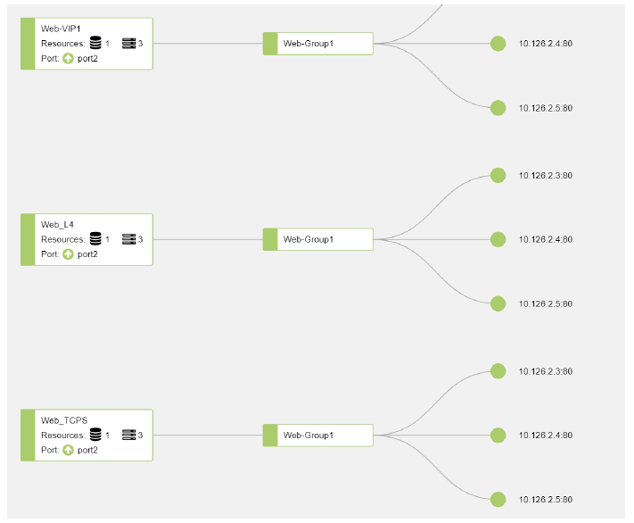
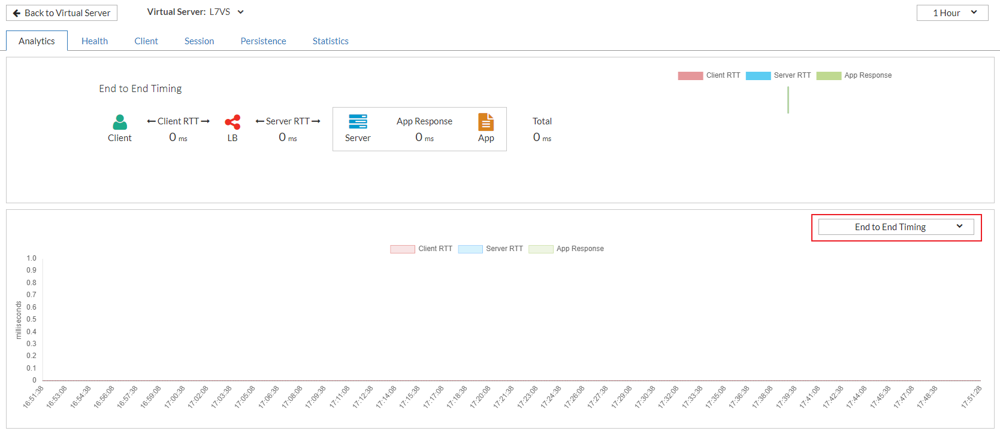
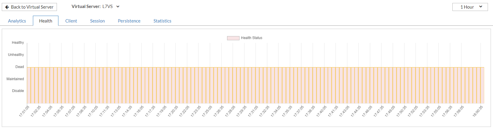
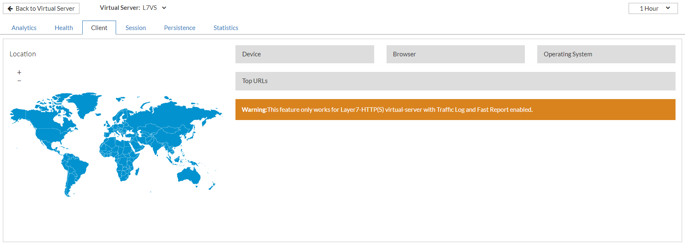
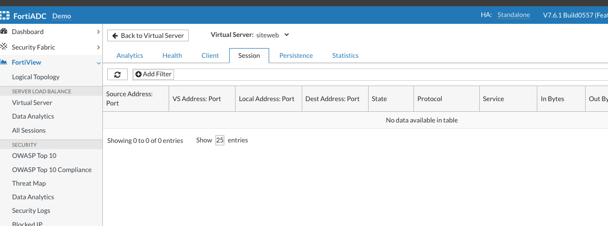
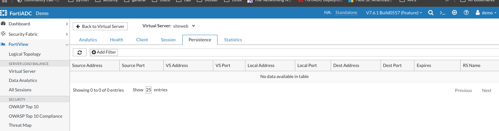
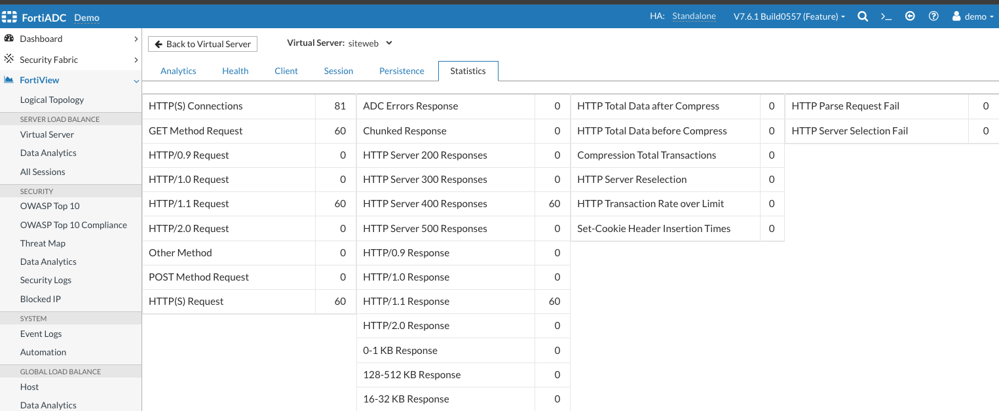

### FortiView

The FortiView pages provide critical insights into your applications and the FortiADC appliance. FortiView offers a comprehensive view of:

- The logical topology of real server pools and their associated members within each virtual server

- Server load-balancing metrics

- Security-related events and other key system alerts

   
   
   The image above is a partial screen capture of the FortiView > Logical Topology page. It shows the internal configuration of a virtual server named "Web_L4, which has the following configurations on it:
   - A real-server pool named "Web-Group1" which contains 3 members (real servers) in it.
   - The virtual server is associated with Port 2, which is up (working).
Apart from viewing the internal configurations of virtual servers, you can also drill down into the components 

The **Analytics** page provides real-time analysis of data about the virtual server using colored icons, charts, and diagrams, etc

The **Health** page uses a bar graph to display the virtual server’s health status over a specified time frame.

The **Client** page provides a global view of the clients accessing the virtual server. It includes detailed sections showing client locations, device types, browser types, and operating systems used to access the application.

The **Sessions** page displays all active sessions currently maintained by the virtual server.

The **Persistence** page lists all active persistence sessions associated with the virtual server.

The **Statistics** page provides traffic and performance metrics specific to the virtual server. This data is available only for HTTP/HTTPS virtual servers.

